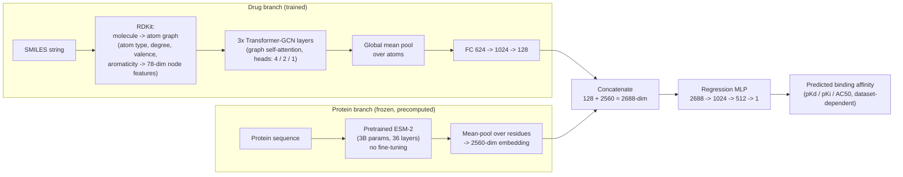

# LEP-AD: Language Embedding of Proteins and Attention to Drugs

Predicting drug–target binding affinity by combining a pretrained protein language model (ESM-2) with a graph-attention encoder for small molecules.

**Paper:** Daga, A., Khan, S.A., Gomez Cabrero, D., Hoehndorf, R., Kiani, N.A., Tegnér, J. *"LEP-AD: Language Embedding of Proteins and Attention to Drugs Predicts Drug Target Interactions."* Presented at the **Machine Learning for Drug Discovery (MLDD) Workshop, ICLR 2023** (non-archival workshop track). Preprint: [bioRxiv 2023.03.14.532563](https://www.biorxiv.org/content/10.1101/2023.03.14.532563v1).

> This is a workshop paper, not a main-conference publication, and the bioRxiv preprint has not been peer-reviewed. Both facts are stated here deliberately — see [Citation](#citation).

---

## What this does

Drug discovery teams need to know, computationally, whether a candidate molecule will bind a target protein — and how strongly — before committing to expensive lab or clinical work. This is the **drug-target interaction (DTI) / binding-affinity prediction** problem: given a protein sequence and a small molecule, predict a continuous affinity score (e.g. pKd, pKi, or AC50).

The standard deep-learning approach represents proteins as raw amino-acid sequences and molecules as either SMILES strings or 2D graphs, then trains an encoder for each from scratch on relatively small labeled affinity datasets (tens of thousands of pairs). LEP-AD's contribution is narrow and practical: **swap the from-scratch protein encoder for a frozen, pretrained protein language model (ESM-2)**, and only train the (much smaller) molecule encoder and fusion head on the downstream task. The paper shows this transfer-learning approach beats several purpose-built DTI architectures on standard benchmarks, and that it scales better with training-set size than an explicit 3D-structure (AlphaFold2) representation of the protein.

If you work in ML infra, the more general point is the one to take away: **large pretrained sequence models transfer well into small-data scientific prediction tasks**, the same pattern behind using pretrained language models or vision backbones as frozen feature extractors elsewhere.

## Architecture



Two things worth being precise about, since the paper title says "attention":

- **Attention lives inside the drug encoder.** The molecule graph is passed through a Graph Transformer (`TransformerConv`, following Shi et al. 2020), which applies self-attention over a molecule's own atoms. There is no cross-attention *between* the drug and protein branches.
- **Fusion is concatenation, not cross-attention.** The pooled drug embedding and the frozen ESM-2 protein embedding are concatenated and passed through a plain MLP regression head. An earlier variant of the model (see `Figure 3` / Appendix A of the paper) fed an AlphaFold2-derived protein contact map through a second Transformer-GCN instead of using ESM-2 directly — that variant was evaluated but not the final chosen configuration (ESM-2 alone was faster to train, similarly accurate, and didn't require running AlphaFold2 per protein).

## Results

Metrics as reported in the paper (Tables 3–5), evaluated on the same train/test splits used by Nguyen et al. (2019)'s GraphDTA benchmark. Lower MSE is better; higher CI and r²m are better. `LEP-AD*` is the ESM-2-based model described above (not the AlphaFold-supervised variant).

| Dataset | MSE | CI | r²m | Best baseline (MSE) |
|---|---|---|---|---|
| Davis (pKd) | **0.222** | **0.896** | **0.723** | GraphDTA (GAT), 0.232 |
| KIBA | **0.135** | **0.895** | **0.780** | GraphDTA (GCN/GAT_GCN), 0.139 |
| DTC (pKi) | **0.171** | **0.881** | **0.830** | GraphDTA (GIN), 0.176 |
| Metz (pKi) | 0.292 | **0.810** | 0.682 | GraphDTA (GCN), 0.317 |
| ToxCast (AC50) | **0.316** | **0.918** | **0.572** | GraphDTA (GCN), 0.316 (tie on MSE) |
| STITCH | 0.986 | 0.745 | 0.461 | not reported for other methods |

Baselines compared against: KronRLS, SimBoost, DeepDTA, MT-DTI, DeepCPI, WideDTA, GANsDTA, Attention-DTA, 1D-CNN, DeepGS, GraphDTA (GCN / GAT_GCN / GAT / GIN variants). Full per-dataset baseline tables are in the paper.

**If you are filling in your own reproduction run**, replace the numbers above only with values you actually observe from `python train.py` / `LEP-AD.py` on your machine — do not extrapolate from the paper's numbers, since exact reproduction depends on data preprocessing, ESM-2 checkpoint version, and train/val split seed.

## Installation

Requires a CUDA-capable GPU (the paper used CUDA 11.4; ESM-2 3B is a large model — plan for ≥16GB GPU memory for the protein-embedding step and a separate, smaller-footprint training run for the downstream model).

```bash
git clone https://github.com/adaga06/LEP-AD.git
cd LEP-AD

# 1. Python environment for this repo
python -m venv .venv
source .venv/bin/activate
pip install -r requirements.txt

# 2. ESM-2 (protein embeddings) — Meta's fair-esm package, installed via pip
pip install fair-esm

# 3. Download the preprocessed benchmark datasets (Davis, KIBA, DTC, Metz, ToxCast, STITCH)
#    See "Data" below for the current source of these files.
```

### Quickstart: reproduce Davis results

```bash
# Step 1 — precompute ESM-2 embeddings for every unique protein in the dataset
python preprocess_data.py --dataset davis

# Step 2 — train LEP-AD on Davis and report MSE / CI / r2m on the held-out split
python LEP-AD.py --dataset davis --batch-size 512 --output_dim 128 --heads 2 --epochs 400
```

To run on another benchmark, swap `--dataset {kiba,dtc,metz,toxcast,stitch}` (data must be preprocessed for that dataset first, same as Step 1).

### Data

The benchmark datasets (Davis, KIBA, DTC, Metz, ToxCast, STITCH), pre-split into train/test CSVs plus cached SMILES-graph and protein-embedding pickles, are currently distributed via a Google Drive link (see repository history). Re-hosting these as a versioned release asset or a Hugging Face Dataset is tracked in `improvement_plan.md` — Google Drive is not a reproducible or citable data source.

## Repository structure

```
LEP-AD/
├── LEP-AD.py              # CLI entry point: trains + evaluates the model on one dataset
├── LEP-AD.ipynb            # Notebook version of the same pipeline
├── model.py                 # GNNNet: the Transformer-GCN drug encoder + fusion MLP
├── train.py                  # train()/predicting() loops used by LEP-AD.py
├── preprocess_data.py    # SMILES -> molecular graph, ESM-2 protein embedding extraction
├── data_protein_esm.ipynb # Notebook for generating ESM-2 protein representations
├── utils.py                    # MSE / concordance index / r2m metric implementations
├── esm.py                     # ESM-2 extraction helper (Davis-specific example)
├── hubconf.py               # PyTorch Hub config for ESM (inherited from facebookresearch/esm)
├── environment.yml         # Conda env for the ESM-2 extraction step
├── environment_LEP_AD.yml # Conda env for the downstream training step
└── setup_and_run.sh         # Scripted end-to-end setup + a sample training run
```

Note the two separate conda environments (`environment.yml` for ESM-2 extraction, `environment_LEP_AD.yml` for training) reflect a real dependency conflict between the ESM-2 tooling and the PyTorch Geometric stack used for the drug graph encoder — not an oversight. `requirements.txt` in this repo covers the training-side (`LEP-AD`) environment only.

## Citation

If you use this code or build on this work, please cite the workshop paper, not a conference proceedings entry — this was presented at the ICLR 2023 MLDD workshop and is not part of the ICLR main conference proceedings.

```bibtex
@inproceedings{daga2023lepad,
  title     = {{LEP-AD}: Language Embedding of Proteins and Attention to Drugs Predicts Drug Target Interactions},
  author    = {Daga, Anuj and Khan, Sumeer Ahmad and Gomez Cabrero, David and Hoehndorf, Robert and Kiani, Narsis A. and Tegn{\'e}r, Jesper},
  booktitle = {Machine Learning for Drug Discovery Workshop, ICLR 2023},
  year      = {2023},
  note      = {Workshop paper (non-archival). Preprint: bioRxiv 2023.03.14.532563},
  url       = {https://www.biorxiv.org/content/10.1101/2023.03.14.532563v1}
}
```

## License

No license file is currently present in this repository, which technically means all rights are reserved by default and others cannot legally reuse the code. Adding an explicit open-source license (MIT or Apache-2.0 are standard for ML research code) is tracked in `improvement_plan.md`.
